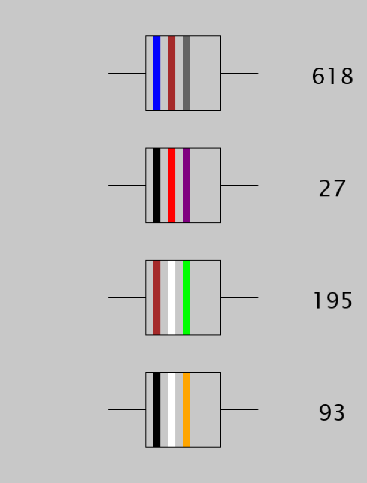

# OOP-Test-2019

## Rules

- You can access the [Java reference](https://docs.oracle.com/javase/7/docs/api/) and the [Processing reference](https://processing.org/reference/) if you need to look something up
- No use of notes or previously written code
- No collaboration or communication

## Description
Resistors are electrical components that resist the flow of current through a circuit. The amount of resistance is measured in ohms. You can tell the resistance of a resistor by reading the colour bars on a resistor. Here is a picture of one.

For the lasb test today you will be making a program to display the colour codes for different resistors. This is what your finished sketch should look like:



There are two files in the data folder of the repository. The file colours.csv looks like this:

```
colour,r,g,b,value
black,0,0,0,0
brown,165,42,42,1
red,255,0,0,2
...
...
```
r,g,b are the RGB values of a colour and the value column repoesents the value associated with the colour. Looking at the above extract from the file, you can see that the colour black represents the value 0 and the color red represents the value 2.

The second file is called resistors.csv and this file contains the resistors you will be visualising. Below is the contents of file:

```
618
27
195
93
```

## Instructions

- Fork [this repository](https://github.com/skooter500/OOP-Test-2019-Starter) to get the starter project. Clone the forked repo and check the upstream and origin remotes are set correctly
- Make a class called Colour that encapsulates the columns from a single row from the colours.csv file. Make the r,g,b and value fields public and the colour field private. Make accessor methods for the colour field. Make a constructor that takes initial values and assigns them to the fields. Make an appropriate toString method.
- In UI.java:
    - Declare an ArrayList called colours that can hold instances of the Colour class
    - Write a method called loadColours that populates the ArrayList from the data in colours.csv file. You can use the processing loadTable method to do this. To get full marks for this, you should write an appropriate overloaded constructor on the Colour object.
    - Write a method called printColours that prints the contents of the colours ArrayList to the console
    - Write a method ```Java public Color findColor(int value)``` that returns the colour object associated with the value parameter.
- Make a class called Resistor that has the following public int fields:
    - value
    - ones
    - tens
    - hundreds
- Make a constructor that takes the value as a parameter and assigns all fields. Here is some sample Java code that you can adapt that takes a number and calculates the ones, tens and hundreds. You will also find this code with some examples in the file UI.java.

```Java
int hundreds = (value / 100);
int tens = (value - (hundreds * 100)) / 10;
int ones = value - ((hundreds * 100)  + (tens * 10));
print(hundreds + ",");
print(tens + ",");
println(ones);
```

In the above code, if value was 381, then hundreds would be 3, tens would be 8 and ones would be 1

- In UI.java, make an ArrayList called resistors to hold instances of the Resistor class. Populate this ArrayList from the resistors.csv file
- Write code in the draw method that renders the resisters as per the screenshot above. To get full marks for this part, you should write an appropriate render method on the resistor class.

## Marking Scheme

| Description | Marks |
|-------------|-------|
| Colour class | 10 marks |
| Loading & printing the colours | 10 marks |
| Finding a color | 5 marks |
| Resistor class | 5 marks |
| Loading the resistors | 10 marks |
| Drawing the resistors | 30 marks |
| Use of git | 10 marks |


    

